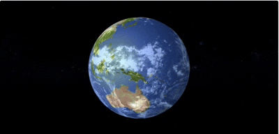

# 🌍 Realistic Earth Visualization using Three.js

<p align="center">

</p>

This project renders a visually realistic 3D Earth using [Three.js](https://threejs.org/), incorporating high-quality textures for surface details, cloud layers, lighting effects, and rotation animation. Ideal for educational platforms, simulations, or interactive web experiences.

You can access live demo [here](https://jordan-will.github.io/threejs-realistic-earth/)

## ✨ Features
- High-resolution **diffuse**, **normal**, and **specular** maps
- Transparent, animated **cloud layer**
- Realistic **lighting** with directional and ambient sources
- Smooth **rotational animation**
- Highly customizable with modular code structure

#💡 Technologies
- Three.js
- JavaScript (ES6+)
- WebGL
- Texture mapping techniques (normalMap, specularMap, MeshPhongMaterial)

# 🌤️ Core Components
- SphereGeometry: Represents the Earth and its cloud layer
- MeshPhongMaterial: For realistic reflection and surface response
- MeshLambertMaterial: Used for soft, diffused rendering of the cloud layer
- DirectionalLight: Simulates sunlight, adds depth and highlights
- AmbientLight: Provides base lighting to avoid full shadow
- requestAnimationFrame: Animates Earth and clouds rotation

## 📁 Assets Used

Place all texture files inside your `public/` or `textures/` folder:

| Texture              | Purpose                          | Filename               |
|----------------------|----------------------------------|------------------------|
| Diffuse Map          | Surface color and details        | `earth.jpg`           |
| Cloud Map            | Semi-transparent clouds layer    | `earthg_clouds.jpg`   |
| Normal Map           | Simulated surface relief         | `earth_normalmap.jpg` |
| Specular Map         | Shiny reflective areas (oceans)  | `earth_specular.jpg`  |

## 🛠️ Setup & Installation
Clone this repo:
   ```bash
   git clone https://github.com/jordan-will/threejs-realistic-earth
   cd threejs-realistic-earth
   open with liver server or index.html
   ```
#  📩 Contact
Created with by Jordan Willian
📧 jordan.willian.mp@gmail.com
